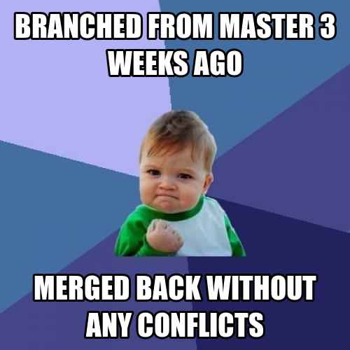
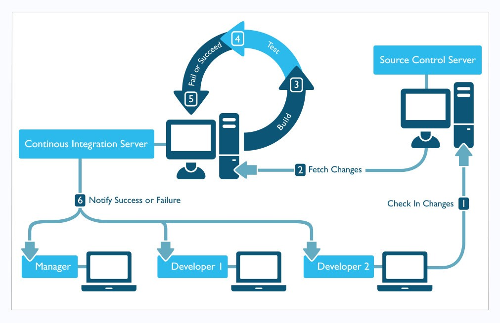

- mkdir ~/Desktop/gitdag
- cd ~/Desktop/gitdag
- create a git repo in this folder.

```
$ git init
```

```
Initialized empty Git repository in /Users/davis/Desktop/gitdag/.git/
```

- Create a file called helloworld.java and insert the following

```
public class helloworld{

   public helloworld(){
      // Nothing too useful here
   }
   public static void main(String[] args){
      System.out.println("hellworld!");
   }
}
```

- Tell git to track the `helloworld.java` file

```
$ git add helloworld.java
```

- Commit your change into your repo

```
$ git commit -m "initial commit"
```

```
[master (root-commit) d1c6fcd] initial commit
1 file changed, 9 insertions(+)
create mode 100644 helloworld.java
```

- What does your git graph look like right now?

```
$ git log --graph --decorate --oneline --branches
```

```
* d1c6fcd (HEAD, master) initial commit
```

- It's ALWAYS a bad idea to develop a new feature on the master branch so let's create a feature branch

```
$ git branch feature
```

- Confirm with git that you indeed created this branch

```
$ git branch
```

```
  feature
* master
```

- However the *star* indicates that you're still in the `master` branch, so go ahead and checkout the `feature` branch

```
$ git checkout feature
```

```
- Go ahead and switch over to branch 'feature'
```

- What does your git graph look like right now?

```
$ git log --graph --decorate --oneline --branches
```

```
* d1c6fcd (HEAD, master, feature) initial commit
```

- Let's make a commit on our feature branch by adding the following to helloworld.java.

```
...
public void test(){
   System.out.println("look at all the testing I'm doing");
}
...
```

- Commit your changes

```
$ git add .
$ git commit -m "adding a testing method"
```

```
[feature 26d356a] adding a testing method
 1 file changed, 3 insertions(+)
```

- What does your git graph look like now?

```
* 26d356a (HEAD, feature) adding a testing method
* d1c6fcd (master) initial commit
```

- Let's make another change on the feature branch to reflect reality. Change the line we just added:

> look at all the testing I'm NOT doing

- Commit your changes and show your git graph.

```
* 68e5a50 (HEAD, feature) adding a change to reflect reality
* 26d356a adding a testing method
* d1c6fcd (master) initial commit
```

- Let's switch back to our master branch. The master branch is generally shared among all developers in our organization. We don't want to introduce bugs otherwise we'll end up getting in everyone's way. 

> If you let this happen, it won't be a good day for you!

- Therefore, you need to `KEEP` the master branch in a prestine condition pretty much all the time however simple cleanup is generally allowed but in practice, this varies between organizations.

- So go ahead and remove the space in helloworld.java so that it looks like the following:

```
public class helloworld{
   public helloworld(){
      // Nothing too useful here
   }
   public static void main(String[] args){
      System.out.println("hellworld!");
   }
}
```

- Commit your change and display the graph

```
* e223b70 (HEAD, master) simple cleanup
| * 68e5a50 (feature) adding a change to reflect reality
| * 26d356a adding a testing method
|/  
* d1c6fcd initial commit
```

- Your boss now tells you that you need to drop everything and fix a field issue!
- So let's make a bugfix branch

```
git checkout -b bugfix
```

- It automatically created the branch and switched over to a new branch 'bugfix'

- Oops I see the issue! We forgot to add my one argument constructor. 
- Add the following to hellworld.java and commit:

```
   ...
   public helloworld(int num){
      // I do cool stuff
   }
   ...
```

- What does your graph look like now?

```
* 3a77e9e (HEAD, bugfix) adding one argument constructor
* e223b70 (master) simple cleanup
| * 68e5a50 (feature) adding a change to reflect reality
| * 26d356a adding a testing method
|/  
* d1c6fcd initial commit
```

- But while on the bugfix branch, you decide that you also need a dedicated test class, test.java, so add the following:

```
public class test{
   public test(){
      // Nothing too useful here
   }
   public static void main(String[] args){
      System.out.println("I <3 testing!");
   }
}
```

- Save and commit your change. Print your graph.


```
* de16ae8 (HEAD, bugfix) adding testing class
* 3a77e9e adding one argument constructor
* e223b70 (master) simple cleanup
| * 68e5a50 (feature) adding a change to reflect reality
| * 26d356a adding a testing method
|/  
* d1c6fcd initial commit
```

- Good Job, You saved the day!
 
- So let's head back to the master branch. While on master, you realize that you spelled helloworld incorrectly. After the fix, helloworld.java should look like this:


```
public class helloworld{
   public helloworld(){
      // Nothing too useful here
   }
   public static void main(String[] args){
      System.out.println("helloworld!");
   }
}
```

```
$ git add .
$ git commit -m "fixing spelling error"
```

- So what does my graph look like now?

```
* 29016b9 (HEAD, master) fixing spelling error
| * de16ae8 (bugfix) adding testing class
| * 3a77e9e adding one argument constructor
|/  
* e223b70 simple cleanup
| * 68e5a50 (feature) adding a change to reflect reality
| * 26d356a adding a testing method
|/  
* d1c6fcd initial commit
```

- You realize at this point that you should bring in the fixes from your bugfix branch. You'll need to perform a merge but in order to do this, you need to `already` be in the branch that you want the changes to be brought into.

```
$ git status
```

```
On branch master
nothing to commit, working directory clean
```


- Ok good, we're indeed on master. So let's merge the bugfix branch into master

```
$ git merge bugfix
```

-  If no merge conflicts are found, we'll immediately be thrown into an editor and asked to specify a commit message. We can just use the default.


```
Merge branch 'bugfix'

# Please enter a commit message to explain why this merge is necessary,
# especially if it merges an updated upstream into a topic branch.
#
# Lines starting with '#' will be ignored, and an empty message aborts
# the commit.
```

- This was a simple merge. Great!



```
Auto-merging helloworld.java
Merge made by the 'recursive' strategy.
 helloworld.java | 3 +++
 test.java       | 8 ++++++++
 2 files changed, 11 insertions(+)
 create mode 100644 test.java
```

- Now that our bugfix branch has been merged we should probably consider deleting the branch since we don't need it anymore but wait, why don't we ask git if this branch has been COMPLETELY merged, just in case.

```
$ git branch --merged
```
```
  bugfix
* master
```
- Notice how bugfix appears on this list. So sure, let's delete it but before we do that let's print the graph.


```git
*   6381175 (HEAD, master) Merge branch 'bugfix'
|\  
| * de16ae8 (bugfix) adding testing class
| * 3a77e9e adding one argument constructor
* | 29016b9 fixing spelling error
|/  
* e223b70 simple cleanup
| * 68e5a50 (feature) adding a change to reflect reality
| * 26d356a adding a testing method
|/  
* d1c6fcd initial commit
```

- Go ahead and delete the bugfix branch

```
$ git branch -d bugfix
```
```
Deleted branch bugfix (was de16ae8).
```

> Note: If the branch was actually not merged, you'll get an error from git complaining that there are changes that you haven't brought over to master. If you insist on deleting this branch anyhow, use `-D` instead of `-d`

- Print the graph again and compare.

```
*   6381175 (HEAD, master) Merge branch 'bugfix'
|\  
| * de16ae8 adding testing class
| * 3a77e9e adding one argument constructor
* | 29016b9 fixing spelling error
|/  
* e223b70 simple cleanup
| * 68e5a50 (feature) adding a change to reflect reality
| * 26d356a adding a testing method
|/  
* d1c6fcd initial commit
```

- So now that we know how to check for merged branches, how do I know what isn't completely merged into master?

```
git branch --no-merged
```
```
  feature
```

- So the feature branch is still yet to be merged. Got it.

- So let's go ahead and merge the feature branch into master. Make sure that you're already in master!

```
$ git merge feature
```
```
Auto-merging helloworld.java
CONFLICT (content): Merge conflict in helloworld.java
Automatic merge failed; fix conflicts and then commit the result.
```

- uh oh, we'll need to fix this before the merge can finish. What does `git status` say?

```
On branch master
You have unmerged paths.
  (fix conflicts and run "git commit")

Unmerged paths:
  (use "git add <file>..." to mark resolution)

	both modified:   helloworld.java

no changes added to commit (use "git add" and/or "git commit -a")
```

- So the issue exists in helloworld.java. Let's look at the file.

```
public class helloworld{
   public helloworld(){
      // Nothing too useful here
   }
<<<<<<< HEAD
   public helloworld(int num){
      // I do cool stuff
=======
   public void test(){
      System.out.println("look at all the testing I'm NOT doing");
>>>>>>> feature
   }
   public static void main(String[] args){
      System.out.println("helloworld!");
   }
}
```

- At this point, git sees that this file was changed in both branches. We'll need to help git decide what needs to be kept. Let's keep both methods and clean this up a bit.

```
public class helloworld{
   public helloworld(){
      // Nothing too useful here
   }
   public helloworld(int num){
      // I do cool stuff
   }
   public void test(){
      System.out.println("look at all the testing I'm NOT doing");
   }
   public static void main(String[] args){
      System.out.println("helloworld!");
   }
}
```

```
$ git add helloworld.java
$ git commit -m "resolving merge issue"
```

- What does our graph look like right now?

```git
*   60f04d4 (HEAD, master) resolving merge issue
|\  
| * 68e5a50 (feature) adding a change to reflect reality
| * 26d356a adding a testing method
* |   6381175 Merge branch 'bugfix'
|\ \  
| * | de16ae8 adding testing class
| * | 3a77e9e adding one argument constructor
* | | 29016b9 fixing spelling error
|/ /  
* | e223b70 simple cleanup
|/  
* d1c6fcd initial commit
```

- Is our feature branch fully checked in?

```
$ git branch --merged
```
```
  feature
* master
```
- Yes. Is there anything else left to merge into master?

```
$ git branch --no-merged
```
```
  
```
- Apparently not


- In retrospect, getting a merge conflict on the master branch is VERY BAD. Your coworkers would have been very upset! How else could we have done this?

- Couldn't we have merged master into feature? 

> Note: But as much as we fight it, it still happens. Have you heard of continous integration techniques?

- So now that the feature branch is merged, let's get rid of it.

```
$ git branch -d feature
```

```
Deleted branch feature (was 68e5a50).
```

- Display your graph and compare with the previous.


```
*   60f04d4 (HEAD, master) resolving merge issue
|\  
| * 68e5a50 adding a change to reflect reality
| * 26d356a adding a testing method
* |   6381175 Merge branch 'bugfix'
|\ \  
| * | de16ae8 adding testing class
| * | 3a77e9e adding one argument constructor
* | | 29016b9 fixing spelling error
|/ /  
* | e223b70 simple cleanup
|/  
* d1c6fcd initial commit
```

##What else can we talk about?

### git reset 
### detached head state 
- So if the HEAD pointer is synonymous with a branch, what does that make be in detached head state? Well, it’s simply a commit hash which isn’t pointed to by a tag or a branch. So, whenever you have checked out a non-referenced head, you end up with a detached head.
```
*   60f04d4 (HEAD, master) resolving merge issue
|\  
| * 68e5a50 adding a change to reflect reality
| * 26d356a adding a testing method
* |   6381175 Merge branch 'bugfix'
|\ \  
| * | de16ae8 adding testing class
| * | 3a77e9e adding one argument constructor
* | | 29016b9 fixing spelling error
|/ /  
* | e223b70 simple cleanup
|/  
* d1c6fcd initial commit
```
- The HEAD pointer is currently at the tip of master but I'm interested in looking at the state of `simple cleanup`
```
$ git checkout e223b70
```
- You'll immediately get the following:
```
Note: checking out 'e223b70'.

You are in 'detached HEAD' state. You can look around, make experimental
changes and commit them, and you can discard any commits you make in this
state without impacting any branches by performing another checkout.

If you want to create a new branch to retain commits you create, you may
do so (now or later) by using -b with the checkout command again. Example:

  git checkout -b new_branch_name

HEAD is now at e223b70... simple cleanup
```
- print the graph to see what's going on

```
*   60f04d4 (master) resolving merge issue
|\  
| * 68e5a50 adding a change to reflect reality
| * 26d356a adding a testing method
* |   6381175 Merge branch 'bugfix'
|\ \  
| * | de16ae8 adding testing class
| * | 3a77e9e adding one argument constructor
* | | 29016b9 fixing spelling error
|/ /  
* | e223b70 (HEAD) simple cleanup
|/  
* d1c6fcd initial commit
```
- Do you see where HEAD is at? It's currently not pointing at the tip of a branch. While this is fine for browsing around to see the state at that commit. You cannot commit unless you wish to create a seperate branch at this point!

- In order to go back, use:
```
$ git checkout master
```
- Look at the graph again:
```
*   60f04d4 (HEAD, master) resolving merge issue
|\  
| * 68e5a50 adding a change to reflect reality
| * 26d356a adding a testing method
* |   6381175 Merge branch 'bugfix'
|\ \  
| * | de16ae8 adding testing class
| * | 3a77e9e adding one argument constructor
* | | 29016b9 fixing spelling error
|/ /  
* | e223b70 simple cleanup
|/  
* d1c6fcd initial commit
```
- Things are golden again.

### git reflog
- Git captures all of your commit activities. Commits that are not currently in use get removed after ~30 days.

```
$ git reflog
```
```
60f04d4 HEAD@{0}: checkout: moving from e223b70b242e2116c9a697e649a3eca818405b6
e223b70 HEAD@{1}: checkout: moving from de16ae85305310299eb822b232a89800b942f47
de16ae8 HEAD@{2}: checkout: moving from master to de16ae8
60f04d4 HEAD@{3}: commit (merge): resolving merge issue
6381175 HEAD@{4}: checkout: moving from feature to master
68e5a50 HEAD@{5}: checkout: moving from master to feature
6381175 HEAD@{6}: merge bugfix: Merge made by the 'recursive' strategy.
29016b9 HEAD@{7}: commit: fixing spelling error
e223b70 HEAD@{8}: checkout: moving from bugfix to master
de16ae8 HEAD@{9}: commit: adding testing class
3a77e9e HEAD@{10}: commit: adding one argument constructor
e223b70 HEAD@{11}: checkout: moving from master to bugfix
e223b70 HEAD@{12}: commit: simple cleanup
d1c6fcd HEAD@{13}: checkout: moving from feature to master
68e5a50 HEAD@{14}: commit: adding a change to reflect reality
26d356a HEAD@{15}: commit: adding a testing method
```


